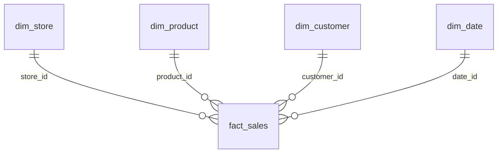

# Specyfikacja importu plików CSV

Ten dokument opisuje, jak przygotować pliki CSV do zaimportowania do bazy SQLite w projekcie klasyfikacji miesięcznej efektywności oddziałów sieci sklepów obuwniczych.

Specyfikacja jest przeznaczona dla osoby, programu albo AI generującego dane wejściowe. Nazwy techniczne plików, tabel, kolumn i komend muszą pozostać dokładnie takie, jak podano poniżej.

## Lokalizacja plików CSV

Wszystkie pliki wejściowe muszą znajdować się w katalogu:

```text
data/input/
```

Wymagane jest dokładnie pięć plików odpowiadających tabelom hurtowni danych:

- `dim_store.csv`
- `dim_product.csv`
- `dim_customer.csv`
- `dim_date.csv`
- `fact_sales.csv`

Każdy plik odpowiada jednej tabeli modelu gwiazdy. Pliki wymiarów opisują sklepy, produkty, klientów i daty. Plik `fact_sales.csv` przechowuje transakcje sprzedażowe i odwołuje się do wymiarów przez identyfikatory.

## Ogólne zasady CSV

Zalecany format:

- kodowanie: UTF-8,
- separator: przecinek `,`,
- pierwszy wiersz musi zawierać nagłówki,
- nazwy kolumn muszą być zapisane dokładnie tak, jak w tej specyfikacji,
- brak pustych nazw kolumn,
- liczby dziesiętne należy zapisywać z kropką, np. `129.99`,
- daty należy zapisywać w formacie `YYYY-MM-DD`,
- pliki nie mogą być puste,
- każdy plik musi zawierać przynajmniej jeden rekord danych.

Aktualny importer sprawdza, czy wymagane kolumny istnieją, a następnie importuje wymagany zestaw kolumn. Dodatkowe kolumny w CSV nie blokują importu, ale są ignorowane. Dla czytelności i mniejszego ryzyka błędów najlepiej przygotować tylko kolumny wymienione w specyfikacji.

## `dim_store.csv`

Tabela `dim_store` opisuje oddziały sklepów obuwniczych.

Wymagane kolumny:

| Kolumna | Typ danych | Wymagana | Ograniczenia | Przykład |
|---|---|---:|---|---|
| `store_id` | liczba całkowita | tak | unikalny identyfikator, brak pustych wartości | `1` |
| `store_name` | tekst | tak | nie powinno być puste | `Warszawa Centrum` |
| `city` | tekst | tak | nie powinno być puste | `Warszawa` |
| `region` | tekst | tak | nie powinno być puste | `mazowieckie` |
| `location_type` | tekst | tak | przykładowe wartości: `shopping_mall`, `high_street`, `retail_park` | `shopping_mall` |
| `store_size` | tekst | tak | przykładowe wartości: `small`, `medium`, `large` | `large` |
| `opening_date` | data tekstowa | tak | format `YYYY-MM-DD` | `2019-03-15` |
| `employee_count` | liczba całkowita | tak | wartość większa od 0 | `12` |

Minimalny przykład:

```csv
store_id,store_name,city,region,location_type,store_size,opening_date,employee_count
1,Warszawa Centrum,Warszawa,mazowieckie,shopping_mall,large,2019-03-15,12
```

## `dim_product.csv`

Tabela `dim_product` opisuje produkty sprzedawane w sklepach obuwniczych.

Wymagane kolumny:

| Kolumna | Typ danych | Wymagana | Ograniczenia | Przykład |
|---|---|---:|---|---|
| `product_id` | liczba całkowita | tak | unikalny identyfikator, brak pustych wartości | `1` |
| `product_name` | tekst | tak | nie powinno być puste | `Sneakers City Run` |
| `category` | tekst | tak | nie powinno być puste | `sneakersy` |
| `brand` | tekst | tak | nie powinno być puste | `Nike` |
| `gender` | tekst | tak | przykładowe wartości: `women`, `men`, `kids`, `unisex` | `unisex` |
| `base_price` | liczba dziesiętna | tak | wartość większa od 0 | `399.99` |

Przykładowe kategorie:

- `sneakersy`
- `buty sportowe`
- `buty eleganckie`
- `botki`
- `kozaki`
- `sandały`
- `klapki`

Minimalny przykład:

```csv
product_id,product_name,category,brand,gender,base_price
1,Sneakers City Run,sneakersy,Nike,unisex,399.99
```

## `dim_customer.csv`

Tabela `dim_customer` opisuje klientów.

Wymagane kolumny:

| Kolumna | Typ danych | Wymagana | Ograniczenia | Przykład |
|---|---|---:|---|---|
| `customer_id` | liczba całkowita | tak | unikalny identyfikator, brak pustych wartości | `1` |
| `age_group` | tekst | tak | przykładowe wartości: `18-25`, `26-35`, `36-45`, `46-60`, `60+` | `26-35` |
| `city` | tekst | tak | nie powinno być puste | `Kraków` |
| `customer_type` | tekst | tak | przykładowe wartości: `new`, `regular`, `loyal`, `occasional` | `regular` |

Minimalny przykład:

```csv
customer_id,age_group,city,customer_type
1,26-35,Kraków,regular
```

## `dim_date.csv`

Tabela `dim_date` opisuje kalendarz sprzedaży.

Wymagane kolumny:

| Kolumna | Typ danych | Wymagana | Ograniczenia | Przykład |
|---|---|---:|---|---|
| `date_id` | liczba całkowita | tak | unikalny identyfikator, brak pustych wartości; zalecany format `YYYYMMDD` | `20250115` |
| `date` | data tekstowa | tak | format `YYYY-MM-DD` | `2025-01-15` |
| `day` | liczba całkowita | tak | dzień miesiąca, zwykle 1-31 | `15` |
| `month` | liczba całkowita | tak | miesiąc 1-12 | `1` |
| `month_name` | tekst | tak | nazwa miesiąca | `styczeń` |
| `quarter` | liczba całkowita | tak | kwartał 1-4 | `1` |
| `year` | liczba całkowita | tak | musi odpowiadać rokowi z kolumny `date`; może być dowolnym rokiem analizowanego okresu | `2025` |
| `season` | tekst | tak | przykładowe wartości: `winter`, `spring`, `summer`, `autumn` | `winter` |

Minimalny przykład:

```csv
date_id,date,day,month,month_name,quarter,year,season
20250115,2025-01-15,15,1,styczeń,1,2025,winter
```

Dla pełnego projektu `dim_date.csv` powinien zawierać wszystkie dni analizowanego okresu. Może to być rok 2025, inny pojedynczy rok albo zakres wielu lat. Aktualny walidator nie wymusza konkretnego roku. Sprawdza natomiast, czy `date` jest poprawną datą oraz czy kolumny `day`, `month`, `quarter` i `year` są zgodne z wartością `date`.

## `fact_sales.csv`

Tabela `fact_sales` przechowuje transakcje sprzedażowe. Jeden rekord oznacza sprzedaż konkretnego produktu w konkretnym sklepie, konkretnego dnia, dla konkretnego klienta.

Wymagane kolumny:

| Kolumna | Typ danych | Wymagana | Ograniczenia | Przykład |
|---|---|---:|---|---|
| `sale_id` | liczba całkowita | tak | unikalny identyfikator transakcji, brak pustych wartości | `1` |
| `store_id` | liczba całkowita | tak | musi istnieć w `dim_store.csv` | `1` |
| `product_id` | liczba całkowita | tak | musi istnieć w `dim_product.csv` | `1` |
| `customer_id` | liczba całkowita | tak | musi istnieć w `dim_customer.csv` | `1` |
| `date_id` | liczba całkowita | tak | musi istnieć w `dim_date.csv` | `20250115` |
| `quantity` | liczba całkowita | tak | wartość większa od 0 | `1` |
| `revenue` | liczba dziesiętna | tak | wartość większa lub równa 0 | `359.99` |
| `discount_amount` | liczba dziesiętna | tak | wartość większa lub równa 0 | `40.00` |
| `is_returned` | liczba całkowita | tak | tylko `0` albo `1` | `0` |

Minimalny przykład:

```csv
sale_id,store_id,product_id,customer_id,date_id,quantity,revenue,discount_amount,is_returned
1,1,1,1,20250115,1,359.99,40.00,0
```

## Relacje między plikami

Relacje odpowiadają kluczom obcym w hurtowni danych:

```text
fact_sales.store_id    -> dim_store.store_id
fact_sales.product_id  -> dim_product.product_id
fact_sales.customer_id -> dim_customer.customer_id
fact_sales.date_id     -> dim_date.date_id
```

Wszystkie identyfikatory użyte w `fact_sales.csv` muszą istnieć w odpowiednich plikach wymiarów. Nie można dodać transakcji dla sklepu, produktu, klienta lub daty, których nie ma w wymiarach.



## Zalecana liczba rekordów

Dla projektu demonstracyjnego zaleca się:

- `dim_store.csv`: 8 sklepów,
- `dim_product.csv`: 40-60 produktów,
- `dim_customer.csv`: 300-600 klientów,
- `dim_date.csv`: wszystkie dni analizowanego roku albo zakresu lat,
- `fact_sales.csv`: 3000-8000 transakcji.

Mniejsza liczba danych może działać technicznie, ale model kNN i dashboard będą mniej reprezentatywne. Po agregacji klasyfikacja odbywa się na poziomie jeden sklep w jednym miesiącu, więc przy 8 sklepach i 12 miesiącach powstaje około 96 rekordów analitycznych. Przy wielu latach liczba rekordów rośnie proporcjonalnie do liczby miesięcy w analizowanym okresie.

## Instrukcja importu z terminala

Import istniejących plików CSV z katalogu `data/input/`:

```bash
python main.py --source csv
```

Wygenerowanie przykładowych danych, zapis do `data/input/`, import do SQLite i uruchomienie całego pipeline'u:

```bash
python main.py --source generated
```

Różnica między trybami:

- `--source csv` używa plików, które już znajdują się w `data/input/`,
- `--source generated` generuje przykładowe dane, zapisuje je do `data/input/`, a następnie importuje tym samym mechanizmem CSV.

Tryb `generated` nie omija importera CSV.

## Najczęstsze błędy importu

Typowe problemy wykrywane przez walidator albo powodujące błędy importu:

- brak wymaganego pliku,
- brak wymaganej kolumny,
- literówka w nazwie kolumny,
- pusty plik CSV,
- plik z samym nagłówkiem i bez rekordów danych,
- duplikaty identyfikatorów w wymiarach,
- `sale_id` nie jest unikalny,
- `store_id` w `fact_sales.csv` nie istnieje w `dim_store.csv`,
- `product_id` w `fact_sales.csv` nie istnieje w `dim_product.csv`,
- `customer_id` w `fact_sales.csv` nie istnieje w `dim_customer.csv`,
- `date_id` w `fact_sales.csv` nie istnieje w `dim_date.csv`,
- `quantity <= 0`,
- `revenue < 0`,
- `discount_amount < 0`,
- `is_returned` inne niż `0` albo `1`,
- błędny format daty w kolumnie `date`,
- niespójność między `date` a kolumnami `day`, `month`, `quarter` albo `year`,
- separator inny niż przecinek,
- liczby dziesiętne zapisane z przecinkiem zamiast kropki.

## Checklist przed importem

Przed uruchomieniem importu sprawdź:

- [ ] Czy wszystkie 5 plików znajduje się w `data/input/`.
- [ ] Czy pliki mają dokładne nazwy: `dim_store.csv`, `dim_product.csv`, `dim_customer.csv`, `dim_date.csv`, `fact_sales.csv`.
- [ ] Czy pierwszy wiersz każdego pliku zawiera nagłówki.
- [ ] Czy nazwy kolumn są zgodne ze specyfikacją.
- [ ] Czy pliki zawierają przynajmniej jeden rekord danych.
- [ ] Czy identyfikatory w wymiarach są unikalne.
- [ ] Czy `sale_id` w `fact_sales.csv` jest unikalny.
- [ ] Czy `fact_sales.csv` odwołuje się tylko do istniejących `store_id`, `product_id`, `customer_id` i `date_id`.
- [ ] Czy wartości liczbowe są poprawne.
- [ ] Czy daty mają format `YYYY-MM-DD`.
- [ ] Czy `dim_date.csv` zawiera wszystkie daty potrzebne w analizowanym okresie.
- [ ] Czy kolumny `day`, `month`, `quarter` i `year` są zgodne z kolumną `date`.
- [ ] Czy pliki są zapisane w UTF-8.
