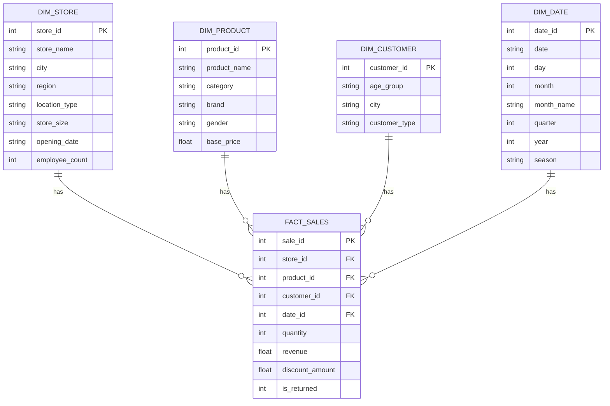

# Model bazy danych

## Tabela faktów i wymiary

Tabela faktów przechowuje zdarzenia biznesowe, czyli transakcje sprzedaży. Tabele wymiarów opisują kontekst tych zdarzeń: sklep, produkt, klienta i datę.

## Dlaczego model gwiazdy

Model gwiazdy jest czytelny i dobrze pasuje do raportowania sprzedaży. Centralna tabela `fact_sales` łączy się bezpośrednio z wymiarami, co upraszcza agregacje do poziomu sklepu, produktu, klienta lub czasu.

## Tabela `fact_sales`

Kolumny: `sale_id`, `store_id`, `product_id`, `customer_id`, `date_id`, `quantity`, `revenue`, `discount_amount`, `is_returned`.

Jeden rekord oznacza sprzedaż konkretnego produktu w konkretnym sklepie, danego dnia, dla konkretnego klienta.

## Wymiary

`dim_store` opisuje oddziały: nazwa, miasto, region, typ lokalizacji, rozmiar sklepu, data otwarcia i liczba pracowników.

`dim_product` opisuje produkty: nazwa, kategoria, marka, płeć docelowa i cena bazowa.

`dim_customer` opisuje klientów: grupa wieku, miasto i typ klienta.

`dim_date` opisuje kalendarz: dzień, miesiąc, kwartał, rok i sezon.

## Relacje

```text
dim_store.store_id       -> fact_sales.store_id
dim_product.product_id   -> fact_sales.product_id
dim_customer.customer_id -> fact_sales.customer_id
dim_date.date_id         -> fact_sales.date_id
```

## Diagram tekstowy

```text
                 dim_product
                      |
dim_store ---- fact_sales ---- dim_customer
                      |
                   dim_date
```

## Mermaid


